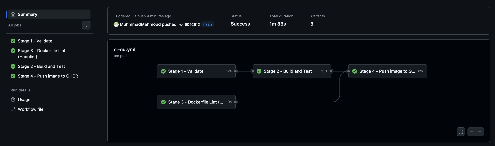
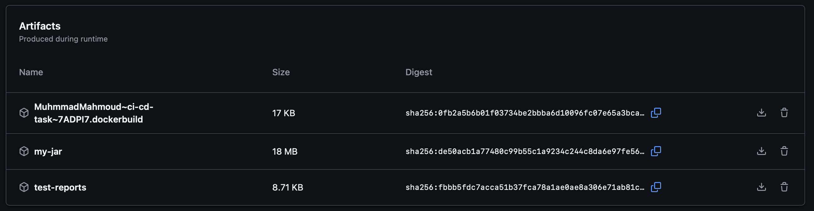
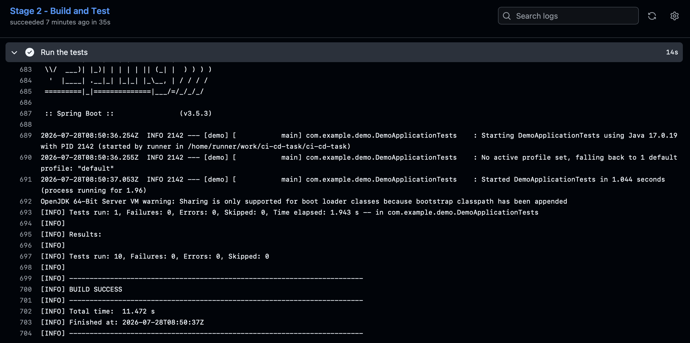
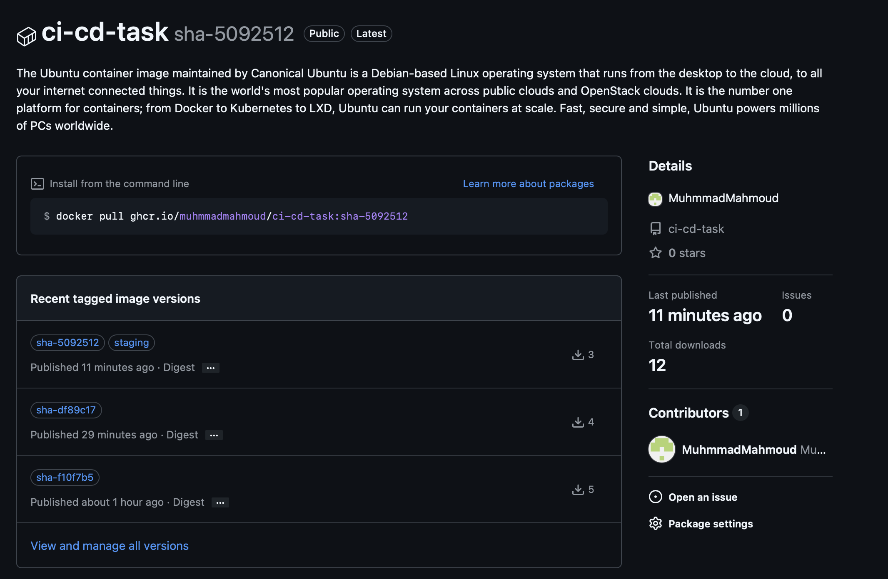
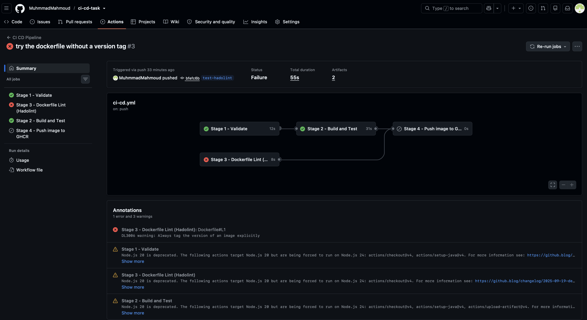

# CI CD Task

Simple Spring Boot project with a GitHub Actions pipeline.

## Endpoints

- `/` returns a hello message
- `/hello?name=Muhmmad` returns Hello Muhmmad !
- `/add?a=2&b=3` returns the result is 5

## Run it

```
mvn clean package
java -jar target/demo-0.0.1-SNAPSHOT.jar
```

Then open http://localhost:8080

## Pipeline stages

1. validate - runs `mvn validate` to check the project quickly
2. build_test - runs the tests, builds the jar, uploads the jar and the test reports
3. dockerfile_lint - runs Hadolint on the Dockerfile, fails if there is a problem
4. docker_publish_staging - only on main, downloads the jar and pushes the image to GHCR

## Image

```
docker pull ghcr.io/muhmmadmahmoud/ci-cd-task:staging
```

## Screenshots

### The pipeline working

All the 4 stages finished with success.



### The artifacts

The jar file and the test reports are saved from stage 2.



### The tests



### The environment variables


### The container registry

The image is pushed to GHCR with the tag `staging` and a tag with the commit id.



### The security gate stopping a bad Dockerfile

I removed the version tag from the Dockerfile on purpose to test stage 3.
Hadolint found the problem, stage 3 failed and stage 4 did not run, so the
image was not pushed.


